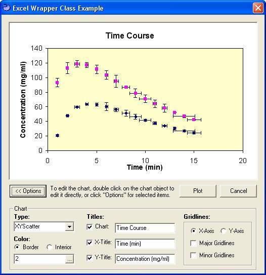



## Excel Chart Wrapper Class

### Description

Does your application require plotting / charting of data? Do you like the plotting styles offered by Microsoft Excel, but do not want, or have time, to create a custom control of your own, then this wrapper class is for you. This class provides a simple interface to the complexities of the Excel object model and provides a simple and effective means to plot your data. Simply place an OLE2 container on your form, add the class to your project, set references, and pass it an array of data. In addition, this class supports either single or bi-directional error bars, and reduces some of complexities in handling this type of data. The chart interface, as with Excel&#8217;s, is fully customizable (colors, styles, grids, axis, fonts, etc..) at runtime, and supports direct OLE2 changes to the chart object by double clicking the object. So, if you need charting support, and do not want to spend a fortune on third party controls, then give this a try&#8230;.
 
### More Info
 

             |
---                |---
**Submitted On**   |2005-04-30 11:47:16
**By**             |[TerriTop](https://github.com/Planet-Source-Code/PSCIndex/blob/master/ByAuthor/territop.md)
**Level**          |Intermediate
**User Rating**    |5.0 (40 globes from 8 users)
**Compatibility**  |VB 4\.0 \(32\-bit\), VB 5\.0, VB 6\.0
**Category**       |[Object Oriented Programming \(OOP\)](https://github.com/Planet-Source-Code/PSCIndex/blob/master/ByCategory/object-oriented-programming-oop__1-47.md)
**World**          |[Visual Basic](https://github.com/Planet-Source-Code/PSCIndex/blob/master/ByWorld/visual-basic.md)
**Archive File**   |[Excel\_Char1882644302005\.zip](https://github.com/Planet-Source-Code/territop-excel-chart-wrapper-class__1-60283/archive/master.zip)

